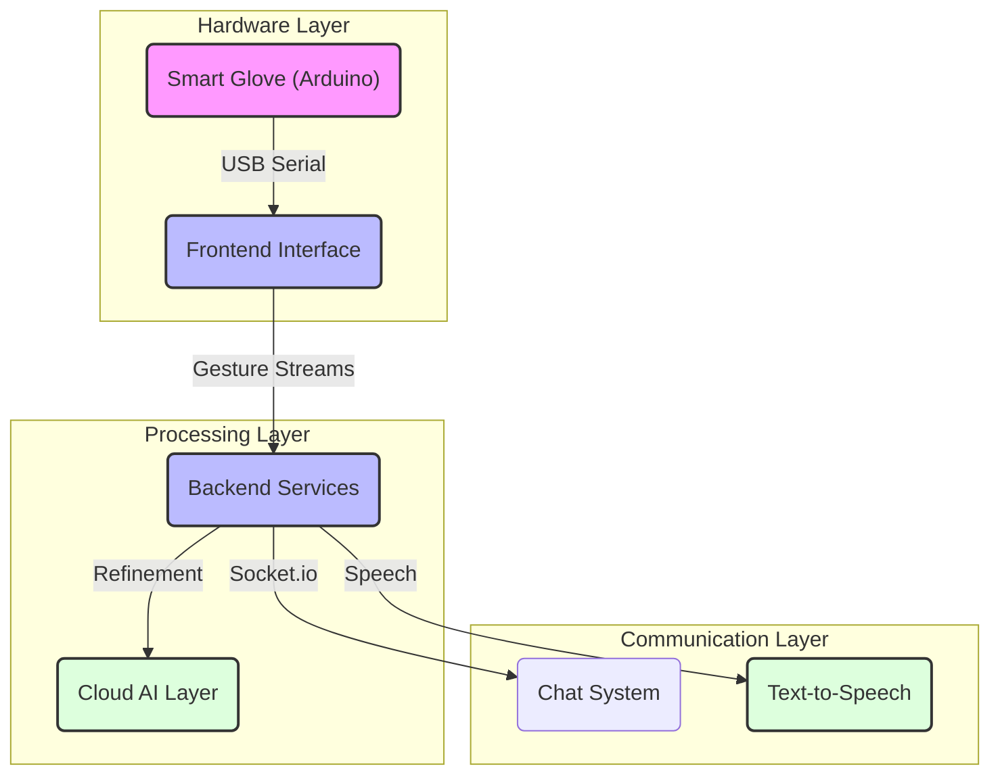

# Voice to Silence - System Architecture

This document provides a technical overview of the **Voice to Silence** ecosystem, explaining how hardware sensors, backend micro-services, and frontend interfaces interact to provide real-time Sign Language-to-Speech translation.

## 📐 High-Level Topology

The system uses a distributed approach where low-level sensor data is processed by local logic before being refined by cloud-based linguistic models.

---

## 🛠 Component Breakdown

### 1. Hardware Interface (The Glove)
- **Sensor Array**: A combination of flex sensors and IMU (Inertial Measurement Unit).
- **MCU**: Arduino Nano/Uno compatible controllers.
- **Data Protocol**: High-speed Serial (9600-115200 Baud) transmitting normalized resistance values.

### 2. Digital Signal Processing (DSP)
- **Normalization**: Mapping raw analog values (0-1023) to a calibrated floating-point range (0.0-1.0).
- **Discretization**: Converting continuous motion into discrete "Finger States" (Bent/Straight/Tension).
- **Thresholding**: Intelligent noise reduction to prevent jitter in prediction.

### 3. Backend Engine (The Core)
- **Prediction Service**: Uses a deterministic mapping tree with machine learning fallback for character recognition.
- **Linguistic Refinement**: Corrects Arabic grammar and forms full sentences from discrete character inputs.
- **Dual-Provider TTS**: Uses local synthesis for low latency and cloud synthesis for high fidelity.

### 4. Communication Protocol
- **Real-time Synchronization**: Powered by **Socket.io** to allow instant message delivery across devices.
- **State Management**: **Zustand** based frontend store tracking glove connectivity and prediction buffers.

---

## 💾 Data Persistence
The system uses **MongoDB** to store:
- User profiles and preferences.
- Message history for the deaf-to-vocal chat.
- Educational video metadata for learning Sign Language.

---

## 🔒 Security & Performance
- **Authorization**: JSON Web Tokens (JWT) for secure identity management.
- **Compression**: Gzip/Brotli compression on REST responses to ensure speed for Flutter/Mobile clients.
- **Caching**: Intelligent caching of common predictions for sub-millisecond response times.
